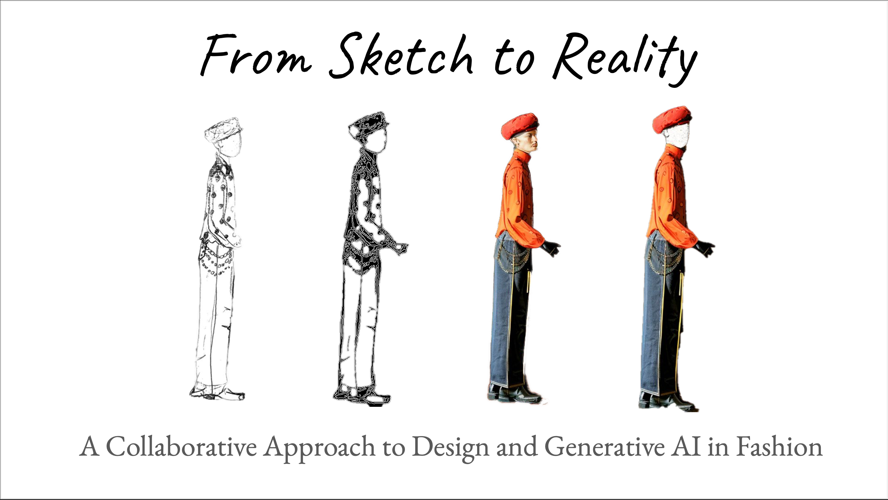

  

# From Sketch to Reality: A Collaborative Approach to Design and Generative AI in Fashion

This repository documents a practice-based research project exploring the integration of generative AI into fashion design. The project fine-tunes Stable Diffusion 2 and ControlNet using a small, ethically sourced dataset composed of the fashion designer’s original sketches and the researcher's photography. The resulting workflow enables the generation of personalised fashion sketches and photorealistic visualisations that preserve the designer’s creative style while supporting sustainable, low-waste prototyping.

> This research was conducted in close collaboration with an independent fashion designer. All AI models were fine-tuned exclusively on personal data to ensure ethical provenance, creative fidelity, and environmental accountability.

The full technical pipeline was built in Google Colab and later extended through post-submission experiments in ComfyUI.

---

## Repository Contents

### 📁 `notebooks/`
Jupyter notebooks used to implement the three main stages of the workflow:

- `sketch_workflow.ipynb`: Fine-tunes Stable Diffusion 2 on designer sketches to create the “sketch-bot”.
- `backdrop_workflow.ipynb`: Fine-tunes RealisticVision-v5.1 on personal photography to generate photorealistic backdrops.
- `controlnet_implementation.ipynb`: Applies ControlNet (Canny and Scribble) using generated edge maps for sketch-to-image conditioning.

> **Note**: Trained model checkpoints are stored externally (Google Drive) and available upon request due to file size.

---

### 📁 `animation/`
Post-submission extension using UniAnimate in ComfyUI for motion experiments:

- `mannequinwalker.mp4`: Three generated fashion animations composited into one video.
- `comfyui_unianimate_workflow.png`: Visual overview of the ComfyUI node graph.
- `UniAnimate.json`: Exported UniAnimate JSON used in the workflow.

---

### 📁 `data_samples/`
This folder contains a selection of representative outputs from each stage of the workflow:

- `sketches/`: Original fashion design sketches
- `backdrops/`: Personal photography used for backdrop fine-tuning
- `edge_maps/`: Canny edge detection maps used for ControlNet
- `generated_sketches/`: AI-generated sketches from fine-tuned SD2
- `photorealistic_outputs/`: Outputs from fine-tuned RealisticVision V51, alongside comparisons between fine-tuned and original RV, as well as captioned and uncaptioned training outputs
- `final_outputs_postprocessed/`: Photoshop-processed final images with mannequin integration

---

## Key Contributions

- **Sketch-to-image generation** with Stable Diffusion 2, fine-tuned on a small dataset of 29 sketches (plus augmentations)
- **Backdrop generation** with RealisticVision-v5.1, fine-tuned on 44 personal photographs
- **Structure control** via ControlNet Canny and Scribble
- **Ethical data practice**, avoiding large-scale scraping and instead leveraging bespoke datasets
- **Co-creative integration** between AI and human designer through iterative dialogue and post-processing

---

## Citation

If referencing this project, please cite:

> *Co-Designing Fashion with AI: A Small-Data Approach to Generative Garment Design*  

---

## Contact

For access to model checkpoints or further collaboration inquiries, please contact the researcher via GitHub or request access via email.